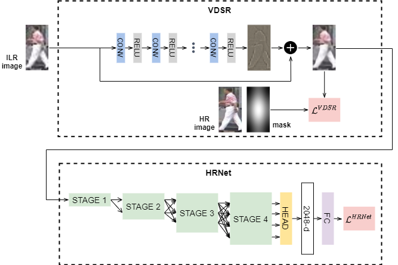
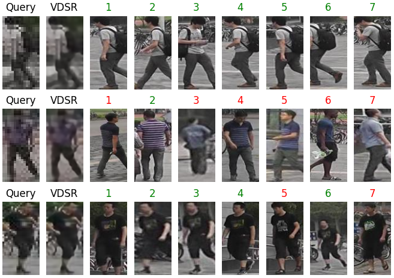

# HRNet for Low-Resolution Person Re-identification

## Introduction
This is the code for the Final Year Project on the title of "Deep Learning Based Methods for Low-Resolution Person Re-identification". This project implements HRNet in the low-resolution person re-identification (LR re-id) setting.



## Quick Start

### Install
1. Install Pytorch==1.7.1 following the [official instructions](https://pytorch.org/).
2. Clone the repository: `git clone https://github.com/jasonsebastian/HRNet-LR-ReID.git`
3. Install dependencies: `pip install -r requirements.txt`

### Data Preparation
Download the [archived dataset](https://www.dropbox.com/s/dp9z1zfrc5jju7s/data.zip?dl=0) and place under `./data/`. Also, download the [pretrained HRNet model](https://1drv.ms/u/s!Aus8VCZ_C_33dYBMemi9xOUFR0w) and place under `./`.

### Train
Train HRNet with VDSR as the super-resolution (SR) module with a batch size of 32 on 1 GPU:
```
python train.py --cfg experiments/cls_hrnet_vdsr_sgd_lr1e-2_warm_gaussian_re_bs32_x50.yaml
```

### Test
Test HRNet with VDSR on 1 GPU:
```
python test.py --cfg experiments/cls_hrnet_vdsr_sgd_lr1e-2_warm_gaussian_re_bs32_x50.yaml
```

You can use a [pretrained model](https://www.dropbox.com/s/uh90lsxox53fw37/final_state.pth.tar?dl=0) for test. Place the pretrained file on `./output/market1501/cls_hrnet_vdsr_sgd_lr1e-2_warm_gaussian_re_bs32_x50.yaml`

### Demo
For example, demo results for HRNet with VDSR:
```
python demo.py --cfg experiments/cls_hrnet_vdsr_sgd_lr1e-2_warm_gaussian_re_bs32_x50.yaml
```

A similar figure as seen below will appear upon running the command:


